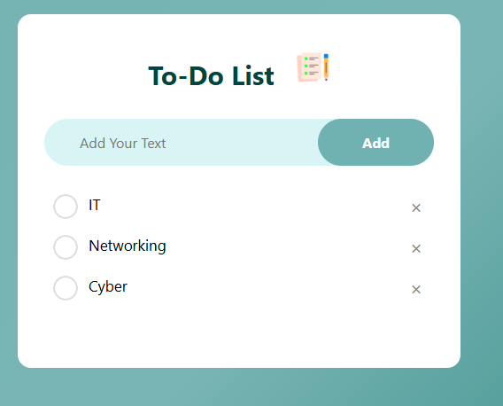

# 📝 To-Do List App

A clean, responsive To-Do List web application built with vanilla HTML, CSS, and JavaScript. It lets you add, check off, and delete tasks — with data persistence using the browser's `localStorage`.

---

## 🚀 Live Demo

> Open `index.html` in your browser to run it locally.

---

## 📁 Project Structure

```
To-Do-List-App/
│
├── css/
│   └── style.css        # All styling for the app
│
├── images/
│   ├── 1.png            # Checked state icon
│   ├── checked.png      # Checked icon variant
│   ├── icon.png         # App title icon
│   └── unchecked.png    # Unchecked state icon
│
├── index.html           # Main HTML structure
└── script.js            # App logic (add, check, delete, save)
```

---

## ✨ Features

- ✅ **Add Tasks** — Type a task and click "Add" to insert it into the list
- ☑️ **Check/Uncheck Tasks** — Click a task to toggle its completed state (with strikethrough styling)
- ❌ **Delete Tasks** — Click the × button on any task to remove it
- 💾 **Persistent Storage** — All tasks are saved to `localStorage`, so they survive page refreshes
- 📱 **Responsive Design** — Works on both desktop and mobile screens

---

## 🛠️ Technologies Used

| Technology | Purpose |
|------------|---------|
| HTML5 | Page structure and layout |
| CSS3 | Styling, gradients, and responsive design |
| JavaScript (ES6) | DOM manipulation and localStorage |

---

## ⚙️ How It Works

### Adding a Task
1. Type your task in the input field
2. Click the **Add** button
3. The task appears in the list below

### Completing a Task
- Click on any task item to toggle it between **completed** (strikethrough + grey) and **active**

### Deleting a Task
- Click the **×** button on the right side of any task to remove it from the list

### Data Persistence
- Every time you add, check, or delete a task, the list is automatically saved to `localStorage`
- On page load, `showData()` restores your saved tasks from storage

---

## 🎨 Design Highlights

- Teal/green gradient background (`#70b2b2` → `#016b61`)
- White card layout with rounded corners
- Custom checkbox icons using PNG images
- Smooth hover effects on the delete button
- Clean pill-shaped input row and button

---

## 🏃 Getting Started

1. **Clone the repository**
   ```bash
   git clone https://github.com/hasitha-ramesh/todo-list-app.git
   ```

2. **Open in browser**
   ```bash
   cd todo-list-app
   open index.html
   ```
   Or simply double-click `index.html` to open it in your default browser.

> ⚠️ No build tools or dependencies required — it's pure HTML, CSS, and JS!

---

## 📸 Screenshot


> 

---


## 🙋‍♂️ Author

Made with ❤️ by **[hasitha-ramesh]**  
GitHub: [@hasitha-ramesh](https://github.com/hasitha-ramesh)
